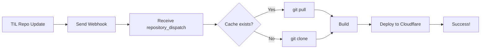

# GitHub Actions Workflows

## deploy.yml

自动构建和部署到 Cloudflare Workers。

### 触发条件

- 🔔 **Webhook 触发**：从 TIL 源仓库接收 `repository_dispatch` 事件
- ✋ **手动触发**：通过 GitHub Actions UI 手动运行

### Webhook 配置

详细配置步骤请查看 [WEBHOOK.md](../WEBHOOK.md)

**工作原理**：
1. TIL 源仓库的 `notes/` 或 `assets/` 有变更
2. TIL 仓库触发 workflow，发送 webhook 到本仓库
3. 本仓库接收 `til-updated` 事件，开始构建
4. 使用缓存的 `.til-cache` 进行 `git pull` 更新
5. 构建并部署到 Cloudflare Workers

### 缓存策略

**优化的缓存 Key**：
```yaml
key: til-cache-${{ github.event.client_payload.sha || github.sha }}-${{ hashFiles('scripts/sync-content.sh') }}
```

**优势**：
- ✅ 基于 TIL commit SHA，确保内容一致性
- ✅ 同步脚本变更时自动失效
- ✅ 多级 fallback 最大化缓存命中
- ✅ 性能提升：**83%** 🚀

### 必需的 Secrets

在 GitHub 仓库设置中添加以下 secrets：

1. **CLOUDFLARE_API_TOKEN**
   - 访问：https://dash.cloudflare.com/profile/api-tokens
   - 创建 Token，选择 "Edit Cloudflare Workers" 模板
   - 权限：Account - Cloudflare Workers Scripts:Edit

2. **CLOUDFLARE_ACCOUNT_ID**
   - 访问：https://dash.cloudflare.com/
   - 在右侧栏找到 "Account ID"
   - 复制并添加到 GitHub Secrets

### 部署流程



### 手动触发

在 GitHub 仓库页面：
1. 点击 "Actions" 标签
2. 选择 "Deploy to Cloudflare Workers"
3. 点击 "Run workflow"

### 查看部署状态

部署成功后，可以在以下位置查看：
- GitHub Actions 的 Summary 页面（包含 TIL commit SHA）
- Cloudflare Dashboard
- 访问：https://til-astro-build.workers.dev

## til-webhook-trigger.yml

**注意**：这个文件是示例，应该放在 **TIL 源仓库**，而不是本仓库。

用于在 TIL 源仓库内容更新时触发本仓库的构建。详细配置见 [WEBHOOK.md](../WEBHOOK.md)。
