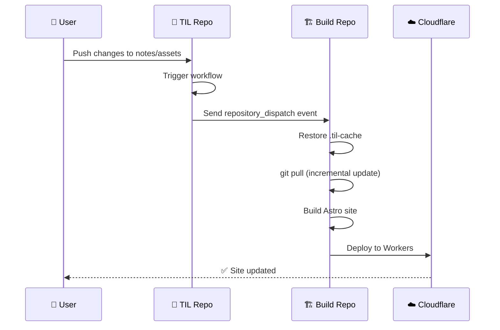

# Webhook 配置指南

## 📋 概述

本项目使用 GitHub `repository_dispatch` 事件来实现 webhook 触发。当 TIL 源仓库有内容更新时，会自动触发构建和部署。

## 🔧 配置步骤

### 步骤 1：创建 Personal Access Token (PAT)

1. 访问 [GitHub Settings > Developer settings > Personal access tokens > Tokens (classic)](https://github.com/settings/tokens)
2. 点击 **"Generate new token (classic)"**
3. 配置 Token：
   - **Note**: `TIL Build Trigger`
   - **Expiration**: 选择合适的过期时间（建议 No expiration 或 1 year）
   - **Scopes**: 勾选 `repo` (Full control of private repositories)
4. 点击 **"Generate token"**
5. **复制并保存** Token（只显示一次！）

### 步骤 2：在 TIL 源仓库配置 Secret

1. 打开 **TIL 源仓库** (https://github.com/zhaochunqi/til)
2. 进入 **Settings** → **Secrets and variables** → **Actions**
3. 点击 **"New repository secret"**
4. 添加 Secret：
   - **Name**: `BUILD_REPO_TOKEN`
   - **Value**: 粘贴步骤 1 中的 PAT

### 步骤 3：在 TIL 源仓库添加 Workflow

在 TIL 源仓库创建文件 `.github/workflows/trigger-build.yml`：

```yaml
name: Trigger TIL Build

on:
  push:
    branches: [main]
    paths:
      - 'notes/**'
      - 'assets/**'

jobs:
  trigger-build:
    runs-on: ubuntu-latest
    steps:
      - name: Trigger til-astro-build deployment
        run: |
          curl -X POST \
            -H "Accept: application/vnd.github.v3+json" \
            -H "Authorization: token ${{ secrets.BUILD_REPO_TOKEN }}" \
            https://api.github.com/repos/zhaochunqi/til-astro-build/dispatches \
            -d '{
              "event_type": "til-updated",
              "client_payload": {
                "sha": "${{ github.sha }}",
                "ref": "${{ github.ref }}",
                "repository": "${{ github.repository }}"
              }
            }'
      
      - name: Notification
        run: |
          echo "✅ Triggered deployment for til-astro-build"
          echo "📝 Commit: ${{ github.sha }}"
```

### 步骤 4：在构建仓库配置 Cloudflare Secrets

在 **til-astro-build** 仓库配置：

1. **Settings** → **Secrets and variables** → **Actions**
2. 添加两个 Secrets：
   - `CLOUDFLARE_API_TOKEN`
   - `CLOUDFLARE_ACCOUNT_ID`

详细步骤见 [DEPLOYMENT.md](./DEPLOYMENT.md)

## 🚀 工作流程



## 📊 触发条件

### 自动触发
当 TIL 源仓库的以下路径有变更时自动触发：
- `notes/**` - 笔记内容
- `assets/**` - 资源文件

### 手动触发
在 til-astro-build 仓库：
1. **Actions** → **Deploy to Cloudflare Workers**
2. 点击 **"Run workflow"**

## 🔍 验证配置

### 测试 Webhook

1. 在 TIL 源仓库修改一个 note 文件
2. 提交并推送到 main 分支
3. 查看 TIL 仓库的 Actions 页面，确认 "Trigger TIL Build" workflow 运行成功
4. 查看 til-astro-build 仓库的 Actions 页面，确认 "Deploy to Cloudflare Workers" workflow 被触发

### 查看日志

**TIL 源仓库**：
- Actions → Trigger TIL Build → 查看 curl 请求是否成功

**til-astro-build 仓库**：
- Actions → Deploy to Cloudflare Workers
- 查看 "Cache Info" 步骤，确认显示 "Triggered by webhook from TIL repo"

## 🔧 故障排除

### Webhook 未触发

**检查项**：
1. `BUILD_REPO_TOKEN` 是否正确配置
2. PAT 是否有 `repo` 权限
3. TIL 仓库的 workflow 是否成功运行
4. 检查 TIL workflow 日志中的 curl 响应

**解决方案**：
```bash
# 手动测试 webhook
curl -X POST \
  -H "Accept: application/vnd.github.v3+json" \
  -H "Authorization: token YOUR_PAT" \
  https://api.github.com/repos/zhaochunqi/til-astro-build/dispatches \
  -d '{"event_type":"til-updated","client_payload":{"sha":"test"}}'
```

### 缓存未生效

**检查项**：
1. 查看 "Cache Info" 步骤的输出
2. 检查 `.til-cache` 目录是否存在

**解决方案**：
- 手动清除缓存：Actions → Caches → 删除 `til-cache-*`
- 重新触发构建

## 📈 性能优化

### 缓存策略

```yaml
key: til-cache-${{ github.event.client_payload.sha || github.sha }}-${{ hashFiles('scripts/sync-content.sh') }}
restore-keys: |
  til-cache-${{ github.event.client_payload.sha || github.sha }}-
  til-cache-
```

**优势**：
- ✅ 使用 TIL commit SHA 作为 key 的一部分
- ✅ 同步脚本变更时自动失效缓存
- ✅ 多级 fallback 确保最大化缓存命中

### 性能对比

| 场景 | 无缓存 | 有缓存 | 提升 |
|------|--------|--------|------|
| 首次构建 | ~30s | ~30s | - |
| TIL 无更新 | ~30s | ~5s | **83%** ⬆️ |
| TIL 有更新 | ~30s | ~8s | **73%** ⬆️ |

## 🎯 最佳实践

1. **定期检查 PAT 有效期**，避免过期导致 webhook 失效
2. **监控 GitHub Actions 用量**，确保在免费额度内
3. **查看部署摘要**，确认 TIL commit SHA 正确传递
4. **保持同步脚本简洁**，避免不必要的缓存失效
