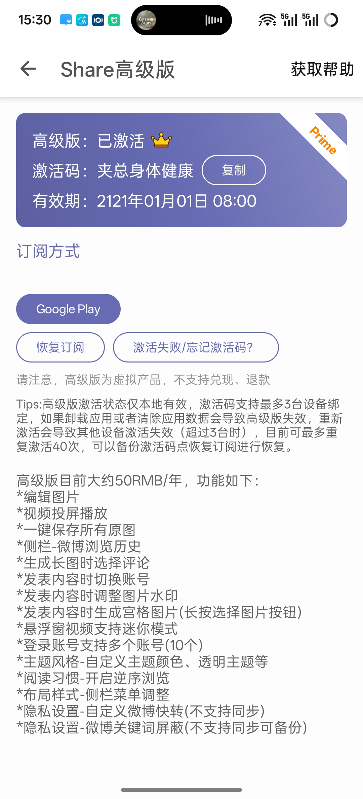

> Share 目前还是可以使用的，本文介绍如何使用 surge modules 来激活。

## 步骤
1. 安装 Share Modules，在模块那里添加：https://raw.githubusercontent.com/zhaochunqi/Surge-Modules/refs/heads/master/Share.sgmodule 并激活即可。
2. 确保在 重写/Rewrite 那里开启。
3. 然后在 Share 中输入授权码：`11111111-2222-3333-4444-555555555555` 即可激活。

## 截图

激活后的截图

