Traefik 底层使用的是 lego 库来处理 ACME (Let's Encrypt) 协议。在标准的 DNS-01 验证流程中，Traefik 会严格遵循 "创建 -> 验证 -> 清理" 的生命周期。所以如果有 _acme-challenge 之类的 dns 记录存在，除非正在签发过程中，否则是可以删除掉的。

签发流程：[LIVE EDITOR](https://mermaid.live/edit#pako:eNqFVmtP21YY_iuWq0qb5ITYzsWJpk6Iy9QPoG3QadqyD8Y-Tqw6duYLlEEk-EALpQO6XmCDFbYVhiZRWomVbtz-TOyEf9Fzjn2cY9MKIiH7nOd93ue9neMZVrFUwFZYzbCmlLpsu8z4YNVk4N-YC9--r7L-6Zz_9zIzODqWyfFM8OhxsLhRZX8IQRSUyWRuMV8A97apWdCsu3Lsrz4P4e2LP4L5w88m7L5bEDBQlw0DmDWAkJ98GnNFtphnYLR_ZGigDpS7M1U2-Gsu2N4N16psi_bcwyGz2WBrKVyaZYYtA4aEX5Ca4-3L31bDPebyyTnWUqO0DH81OEppSfOu7xDeOw7GQs722UXn6b6_so3Sg9ZSWaEU4JiGNA0orj5J7FGGzteTyzFF5OaqIe0hsYGhX9rAASYu2-Kmf_I_M_7tONN99do_e4ZDjvapSMP_0XrEYU3qKrBJ-mHlmWB1rX2-6T-733lz4r9YTlUhYREmbOeB_-B-bDWLWsRUZVslUKgwxDAJeiyys3kUrOxeCSCWfNVd_8DIUAYSzTLoCT5Qbshez0kq9pQJzkG_olie6SY7sHu0Fywex7HTGKwi3PcPNvytfdgoTVV2AZSPQoURPX_9oVg-QtJ-9zPhGbAB5IlwcWEhHZGTCCaB7o3S1-BHT7eBitru4qm_-YIZsu3EDs785dZcd28-WFr2H-5H-Y-mjp4LYoLpR2TTkw0yZ1dN0wFTeGwfpyl1oCS6hfRlU67Jrm6Z0FPnYMk_X8Dd0z7dCX456I0OYUxbpVqWLIcwOKy6WUP5OXvVPfwzrDhOypSsu9lhy6aGJkJjy29kQ0cOYZtc_vOoezgfLK75D7c_T80IgYXjsXEICwts97bjeGFVDufb_-11Ds791cchQewsYemv7c0y43oDWJ4LPXbfLgTrb9O-ov2eK1hsy8ZJQ_z-yzfdo92Yn0Zj-ii6RFvFWsOeMgAsYxMV_N1CZy0cYuqYwft3mlTGsALaNsEeLuHtQWAAMjb-4s7lry8_NDYxKjwgTZTC4N_5zv5y5-RJ8Pt2aipu3mSCnWP_dDV8VQzZcQaBxqhAkz3DZTTdMCo3tDL6cY5rW3dB5YYoitFzZkpX3XpFaN5L2TdtSwGOE9kDXitoILbP8YVSeeI6ChUouoO6MNKgaSLIxRygWOBzues4AE4uIQAToCdCKQqSIF1H4HgKHYekFYAUUwigpIrCRygoInKBc9TFx0X3GJe4qrjouuHSc87Fs8tRA8pFDclFfcL1qh8VgFbRu7q5xEXB0UctR4aKI91P6nCFipx2HHVycWE747wnDOIx4WBPkrSyHNsAdkPWVfihNYPwVdatgwaoshX4GDVhla2aLQiVPdcamzYVtuLaHuBY2_JqdbaiyYYD3zycoEFdrtlyI15tyuZ3ltUgJkDVXcseCb_s8AcehrCVGfYeWykUhSyfK5cKUl4UCsWixLHTbCUj5qWsyOdLxTLPSzkxX25x7E-YlM_CTpZ4QSwUy3lJKggFjq3ZKJpIITBRklFyIVgiIoewilijYckQhTS4000krKY7LhSmWKam19C6Zxtwue66TafS14e2szXdrXsTWcVq9Dm6ir5P65PlYl9RKEqyIIJiSZQLoqgqE3xZ0oQ8r6mlHC_IbKvVeg_2KAcV) 

```mermaid
flowchart TD
    Start["开始 DNS-01 挑战"]
    
    Start --> GetInfo["获取挑战信息<br/>GetChallengeInfo()"]
    GetInfo --> CNAMECheck{"检查 CNAME"}
    
    CNAMECheck -->|有 CNAME| FollowCNAME["跟随 CNAME 链<br/>getChallengeFQDN()"]
    CNAMECheck -->|无 CNAME| UseFQDN["使用原始 FQDN"]
    
    FollowCNAME --> EffectiveFQDN["获得 EffectiveFQDN"]
    UseFQDN --> EffectiveFQDN
    
    EffectiveFQDN --> Present["创建 TXT 记录<br/>Present()"]
    
    Present --> ProviderCheck{"DNS 提供商类型"}
    
    ProviderCheck -->|标准提供商| StandardProvider["标准 DNS 提供商<br/>直接创建 TXT 记录"]
    ProviderCheck -->|ACME-DNS| ACMEDNSProvider["ACME-DNS 提供商"]
    
    ACMEDNSProvider --> AccountCheck{"检查账户"}
    AccountCheck -->|账户存在| UpdateTXT["更新 TXT 记录"]
    AccountCheck -->|账户不存在| CreateAccount["创建新账户"]
    
    CreateAccount --> CNAMERequired["返回 ErrCNAMERequired<br/>需要手动创建 CNAME"]
    CNAMERequired --> ManualCNAME["手动创建 CNAME 记录"]
    ManualCNAME --> UpdateTXT
    
    StandardProvider --> Propagation["等待 DNS 传播"]
    UpdateTXT --> Propagation
    
    Propagation --> Polling["轮询检查<br/>wait.For()"]
    Polling --> Validate{"验证成功?"}
    
    Validate -->|是| CertIssued["证书签发成功"]
    Validate -->|否| Timeout{"超时?"}
    
    Timeout -->|是| Error["签发失败"]
    Timeout -->|否| Polling
    
    CertIssued --> Cleanup["清理 DNS 记录<br/>CleanUp()"]
    Error --> Cleanup
    
    Cleanup --> DeleteTXT["删除 TXT 记录"]
    DeleteTXT --> End["流程结束"]
    
    %% 样式
    classDef default fill:#f9f9f9,stroke:#333,stroke-width:2px
    classDef process fill:#e1f5fe,stroke:#01579b,stroke-width:2px
    classDef decision fill:#fff3e0,stroke:#e65100,stroke-width:2px
    classDef error fill:#ffebee,stroke:#c62828,stroke-width:2px
    classDef success fill:#e8f5e8,stroke:#2e7d32,stroke-width:2px
    
    class GetInfo,FollowCNAME,UseFQDN,EffectiveFQDN,Present,StandardProvider,UpdateTXT,Propagation,Polling,Cleanup,DeleteTXT process
    class CNAMECheck,ProviderCheck,AccountCheck,Validate,Timeout decision
    class CNAMERequired,ManualCNAME,Error error
    class CertIssued,End success
```

